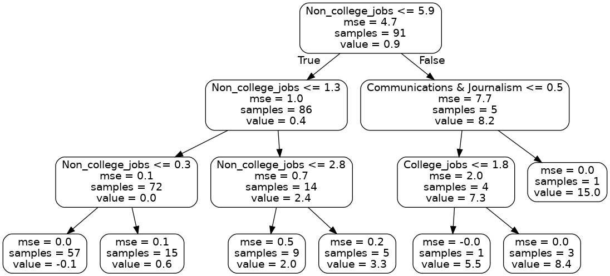
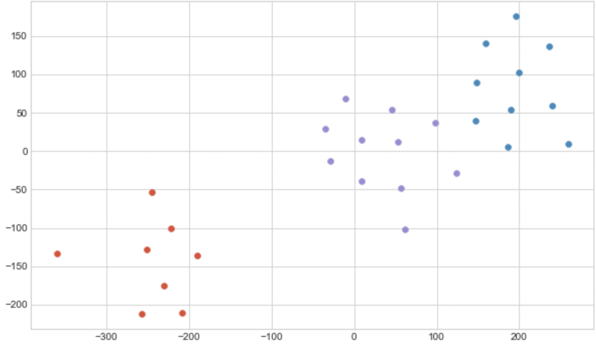

# Abstract

# Introduction
Many students after finishing high school have either a vague idea about their college major or they enter college with an undeclared major. Many[@article] students change their major either after the first semester or at most after the first year they completed because they could not continue in the current major for different reasons such as they did not like the major, they could not get good GPA and/or they find it difficult for them to process with the current major. Some students change their major multiple times because they are unsure about their future goals. On the other hand, some students decide to drop out of college to work minimum wage jobs. In all these scenarios, economic factors play a pivotal role in making their decisions. While deciding their majors, there are multiple factors which most of the students fail to consider such as the employment ratio in that field, the number of job opportunities, the median pay etc. Looking at Fig 1, we see that Psychology is at the top of the list of top 10 popular majors. Based on that, it is evident that for a lot of students, Psychology is the number one choice of major in college. However, if we look at Fig 2, we can see the unemployment rates for the least ranked majors based on median salary. Out of all the majors in the list, three of the lowest ranked majors with high unemployment rates are related to Psychology, with Clinical Psychology right at the top of high unemployment list. This clearly shows and emphasizes the point that a popular major choice doesn't necessarily guarantee job security. Therefore, it is imperative to educate students about economic factors before they decide on their college majors.

            
```Fig 1: Top 10 ranked majors by Popularity```				            
 
```Fig 2: Unemployment rates for the 10 least ranked majors based on median salary```

# Methods
## Dataset
The dataset used in this analysis is from American Community Survey 2010-2012 Public Use Microdata Series. This dataset contains information about college majors. Five csv's detailing a list of majors were considered for this study, statistical information about graduate students with age less than 28 and more than 25, and a comprehensive file about all ages. It also contains data about women employment in STEM fields. The dataset was pretty clean and only handling of missing and null values was required as a part of preprocessing. To visualize the data we have used correlation matrix, bar charts, line plots, box plots and scatter plots. Methods such as DBSCAN clustering, Random Forest Regression and dimensionality methods like Principal Component Analysis, Single value decomposition, Locally linear embedding and Distributed Stochastic Neighbor Embedding are used for data analysis. 

## 1. Clustering using DBSCAN
One of the methods which we used for the analysis was Clustering using DBSCAN. For the analysis, `grad-students.csv` file was used as the dataset to perform clustering using DBSCAN. Since the number of clusters were not pre-defined, DBSCAN generated clusters based on the provided parameters. DBSCAN[@ester1996density] requires radius as a parameter and minimum number of core points to be within the circle defined by the radius to form a cluster. There are two major factors to keep in mind while prioritizing economic factors in choosing a major. These two factors are salary and employment opportunity. Both of these factors go hand in hand to ensure the financial success post graduation. Therefore, we decided to perform clustering on the two features: Major Category and Median Salary. This will give us an idea on what average salary to expect from each major and major category.

            
```Fig 3: DBSCAN Clustering on Major Category and Median Salary```

Looking at Fig 3, we can conclude that most of the majors pay in the range of $60,000 - $80,000. We then calculated the employment rate from the data that was available to us and performed clustering on features - Employment Rate and Major Category.
On the other hand, Fig 4 shows us DBSCAN Clustering on Major Category and Employment Rate. Combining the results of both these plots show us that even though employment rates are pretty high in category 6, it is infeasible considering the median pay. Category 13 (Physical Sciences) seems to be the safest choice with good pay and employment opportunities. But, if one is willing to aim for a high end salary, category 7 (Engineering) is a good choice as it pays better than every other category but some majors have lower employment than others.

 
```Fig 4: DBSCAN Clustering on Major Category and Employment Rate```

## 2. Random Forest Regression


```Fig 5: High variance in Low wage jobs based on Major Category and Number of College jobs```

Another method which we used in our analysis was Random forest regression. It proved to be an ideal method for 'recent-grads.csv' dataset file as we were predicting the values of low wage jobs in a particular major category on the basis of unemployment rate, jobs that require a college degree and jobs that don't require a college degree. Also it was evident from the plot above,Fig 5 that this field displayed high variance based on these factors. A single analysis method or a decision tree would not give accurate results so a supervised learning method on continuous values was selected which is random forest regression.

Our dataset had categorical values namely the field of 'Major_category'.But regression model requires numerical values for the algorithm. To handle this best possible method was to perform one hot encoding[@seger_an]. Further to increase the accuracy of model Robust Scalar feature scaling was performed. Robust Scaling can handle skewed data as well as outliers optimally as it removes the median and scales the data according to the quantile range(IQR). The InterQuartileRange is the range between the 1st quartile (25th quantile) and the 3rd quartile (75th quantile). After scaling the data, the dataset was divided in training dataset and testing dataset and was run over random forest regressor algorithm to device a model. Further steps could still be taken if time permits, to improve the accuracy of the model. 


```Fig 6: Randomly selected decision tree of depth 3```

It is clear from the above decision tree that the number of low-wage jobs is high especially in the field of Communication and Journalism where a college degree isn't required to work.

## 3. Principal Component Analysis 
 Principal component analysis [@wold1987principal] is a technique for dimensionality reduction, which increases the interpretability of the data but at the same time minimizes information loss. The consolidated data of all the majors for graduate, undergraduate, female students and the encoded values for the majors and major categories leads to multiple columns and it is hard to draw inferences and visualize from this consolidated data, hence by using principal component analysis we can reduce the data to those columns whose values lead to maximum variation. The PCA algorithm forms principal components on which the variance of the data is to be measured upon and these are compared to get the component that produces maximum variation.  

 ```Fig 7 : Percentage variation produced by each Principal Component```  

After applying the PCA algorithm we can see that the majority of the variation is along with the first two components (Fig 7) namely, PC1 and PC2. Hence, a 2D graph using these two components will do a good job representing the original data. In Fig 8 we can see that the samples form clusters which indicate that the samples on the right are correlated to each other and the samples on the left are correlated to each other. Also, the separation between the samples indicates how similar they are to each other, the closer the samples are to each other the more similar they are and vice versa. The top ten loading scores for the principal component show us the values which play a role in separating the samples.

 ```Fig 8 : Plotting the samples based on the Principal Component 1 and Principal Component 2```

# Conclusions


# References
