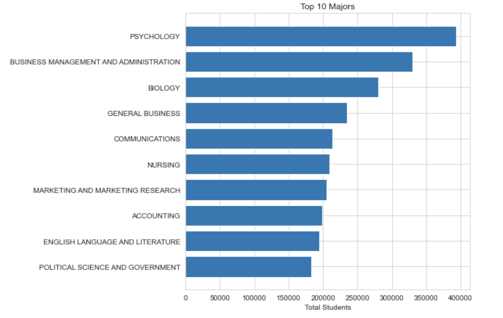
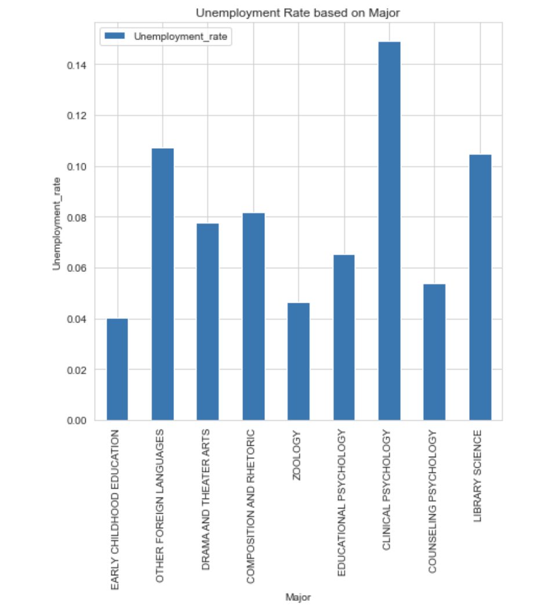
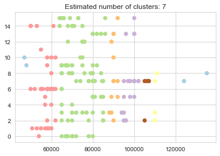
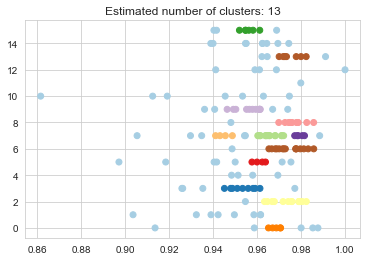

# Abstract

# Introduction
Many students after finishing high school have either a vague idea about their college major or they enter college with an undeclared major. Many[@article] students change their major either after the first semester or at most after the first year they completed because they could not continue in the current major for different reasons such as they did not like the major, they could not get good GPA and/or they find it difficult for them to process with the current major. Some students change their major multiple times because they are unsure about their future goals. On the other hand, some students decide to drop out of college to work minimum wage jobs. In all these scenarios, economic factors play a pivotal role in making their decisions. While deciding their majors, there are multiple factors which most of the students fail to consider such as the employment ratio in that field, the number of job opportunities, the median pay etc. Looking at Fig 1, we see that Psychology is at the top of the list of top 10 popular majors. Based on that, it is evident that for a lot of students, Psychology is the number one choice of major in college. However, if we look at Fig 2, we can see the unemployment rates for the least ranked majors based on median salary. Out of all the majors in the list, three of the lowest ranked majors with high unemployment rates are related to Psychology, with Clinical Psychology right at the top of high unemployment list. This clearly shows and emphasizes the point that a popular major choice doesn't necessarily guarantee job security. Therefore, it is imperative to educate students about economic factors before they decide on their college majors.

            
```Fig 1: Top 10 ranked majors by Popularity```				            
 
```Fig 2: Unemployment rates for the 10 least ranked majors based on median salary```

# Methods
## 1. Clustering using DBSCAN
One of the methods which we used for the analysis was Clustering using DBSCAN. For the analysis, `grad-students.csv` file was used as the dataset to perform clustering using DBSCAN. Since the number of clusters were not pre-defined, DBSCAN generated clusters based on the provided parameters. DBSCAN[@ester1996density] requires radius as a parameter and minimum number of core points to be within the circle defined by the radius to form a cluster. There are two major factors to keep in mind while prioritizing economic factors in choosing a major. These two factors are salary and employment opportunity. Both of these factors go hand in hand to ensure the financial success post graduation. Therefore, we decided to perform clustering on the two features: Major Category and Median Salary. This will give us an idea on what average salary to expect from each major and major category.

            
```Fig 3: DBSCAN Clustering on Major Category and Median Salary```
	
Looking at Fig 3, we can conclude that most of the majors pay in the range of $60,000 - $80,000. We then calculated the employment rate from the data that was available to us and performed clustering on features - Employment Rate and Major Category.

On the other hand, Fig 4 shows us DBSCAN Clustering on Major Category and Employment Rate. Combining the results of both these plots show us that even though employment rates are pretty high in category 6 (Education), it is infeasible considering the median pay. Category 13 (Physical Sciences) seems to be the safest choice with good pay and employment opportunities. But, if one is willing to aim for a high end salary, category 7 (Engineering) is a good choice as it pays better than every other category but some majors have lower employment than others.

 
```Fig 4: DBSCAN Clustering on Major Category and Employment Rate```

# Comparisons

# Example Analysis

# Conclusions


# References
